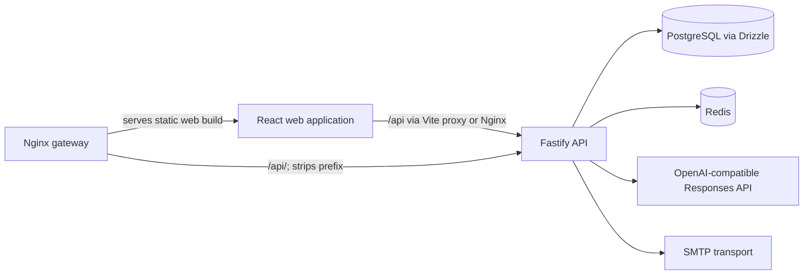
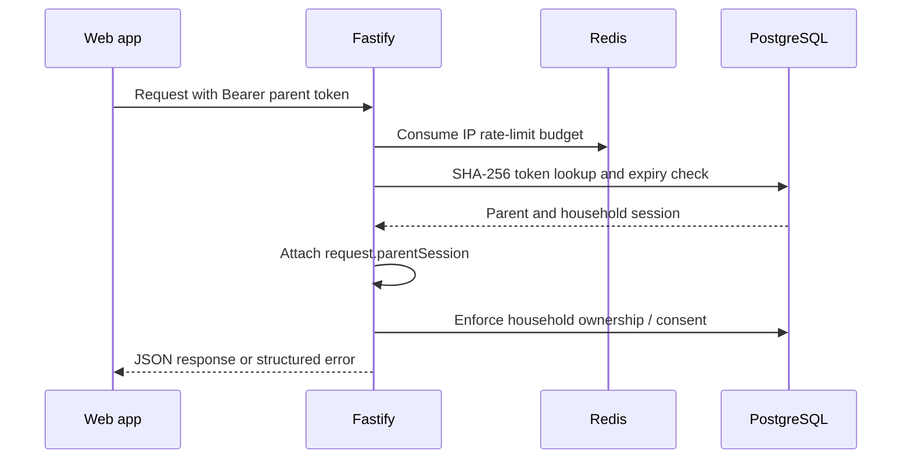
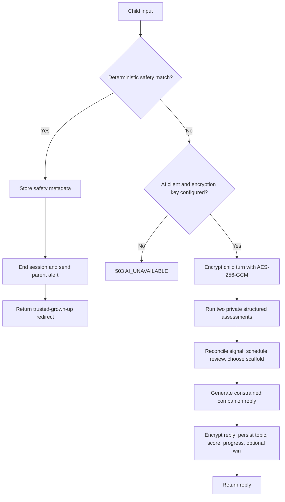
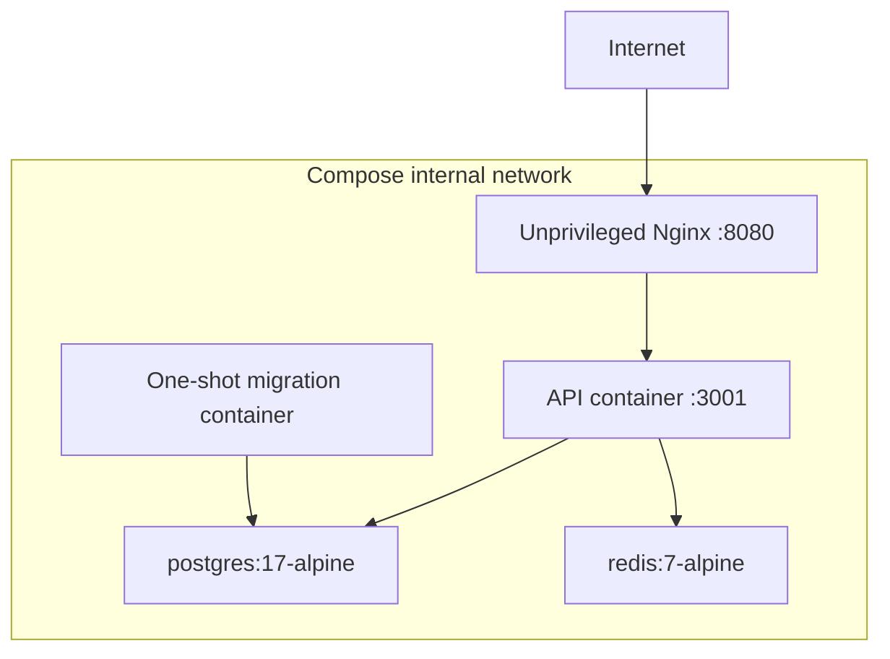

# Architecture

## Component topology

The browser calls `/api/*`. Vite rewrites `/api` away in local development; Nginx does the same in the production Compose topology. Fastify therefore registers routes such as `/students`, not `/api/students`.

## Authenticated request flow

Only health, readiness, and identity routes are public. Student, session, and dashboard routes are registered inside the parent-auth plugin.

## Evening learning turn

Idempotency is enforced before this flow. A `(sessionId, idempotencyKey)` pair can replay a completed response only when its input hash matches; an unfinished or mismatched duplicate receives `409`.

## Deployment topology

The production Compose file waits for Postgres and Redis health checks, runs migrations once, then starts the API. The development overlay enables watch-mode API and Vite services and disables the production gateway unless its profile is selected.

## Cross-cutting behavior

- `registerMiddleware` installs request IDs, Helmet, Redis-backed rate limiting, pressure checks, and JSON body-content enforcement.
- `createServer` owns composition: it creates infrastructure clients, services, and route registration in one place.
- Repositories are the only API-module layer that issues Drizzle queries. Modules receive a frozen aggregate of repository functions.
- Error payloads use `{ "error": { "code", "message", "requestId" } }`; the request ID is absent only where the underlying framework error response is returned directly.
