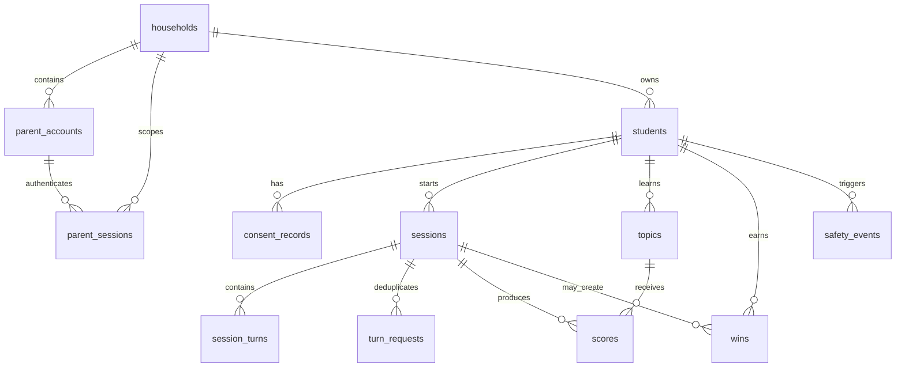

# Data model

PostgreSQL is the system of record. Drizzle definitions live in `apps/api/src/platform/database/schema`; committed SQL migrations live in `apps/api/drizzle`. UUID primary keys are database-generated unless noted.

## Relationship map

## Identity and tenancy

| Table | Important columns and purpose | Indexes/constraints |
| --- | --- | --- |
| `households` | `id`, name, IANA-like `time_zone` (default `UTC`), creation time. Tenant root. | Primary key. |
| `parent_accounts` | Household FK, display name, normalized-by-repository email, optional Argon2 password hash, email-verification and magic-token hashes/times. | Email index; no database uniqueness constraint on email. |
| `parent_sessions` | SHA-256 token hash primary key, parent and household FKs, created/expiry times. | Token-hash primary key. Expired rows are not automatically deleted. |

Development fixtures may use fixed UUIDs only when `ENABLE_DEV_FIXTURES=true` outside production. No production route can create a local parent session.

## Student, consent, and session tables

| Table | Important columns and purpose | Indexes/constraints |
| --- | --- | --- |
| `students` | Household FK, name, grade, optional morning/evening routine text, creation time. | Household/id index. |
| `student_ritual_settings` | Per-child routine controls plus an optional parent-selected interaction-band override (`early`, `explorer`, `independent`). The override changes presentation and prompt scaffolding; it is not a date of birth. | Primary key on student. |
| `consent_records` | Household and student FKs, purpose, notice version, status, verification reference, grant/withdraw/expiry timestamps. | Unique `(student_id, purpose)` and lookup index. Enum: `pending`, `granted`, `withdrawn`, `expired`. |
| `sessions` | Student FK, `type`, start/end data, end reason, turn count, scaffold stage. | Student/start-time index. `session_type`: `morning`, `evening`. |
| `turn_requests` | Session FK, idempotency key, SHA-256 input hash, response cache/status, timing. | Unique `(session_id, idempotency_key)`. Incomplete records are removed after a failing turn. |
| `session_turns` | Session FK, role, AES-GCM ciphertext, IV, authentication tag, key version, creation time. | Session/creation-time index. Only normal evening inputs/responses are inserted. |

## Learning and safety tables

| Table | Important columns and purpose | Indexes/constraints |
| --- | --- | --- |
| `topics` | Student FK, label, first-seen/review timestamps, spaced-review ease and interval. | Unique `(student_id, label)` and review lookup index. |
| `scores` | Session and topic FKs, understanding/confidence, gap label, assessment time, assessor agreement. | Topic/assessment-time index. Scores are heuristic 0–4 values from the AI workflow. |
| `wins` | Student FK, optional session FK, type, parent-visible effort message, creation time. | Student/creation-time index. |
| `safety_events` | Student FK, optional session FK, category, creation/acknowledgement time, email status. | Student/creation-time index. No triggering text column exists. |
| `outbox_events` | Durable event payload, idempotency key, aggregate identifiers, lifecycle timestamps, attempt/error state. | Unique idempotency key; status/availability and aggregate indexes. Enum: `pending`, `processing`, `completed`, `dead_letter`. No producer or worker currently uses this table. |
| `product_analytics_events` | Parent-opt-in, allowlisted family-setup lifecycle event names only. It never stores child free text, transcript content, names, or email addresses. | Created-at index for aggregate reporting. |

## Migrations and changes

Run `npm run db:generate` after changing schema definitions, inspect the generated SQL/metadata, then run `npm run db:migrate`. The migration runner loads configuration and applies the committed migration folder through Drizzle. Never edit an already-applied migration in a deployed environment; create a forward migration instead.

## Redis

Redis is not a primary data store. Fastify uses it for shared IP-based rate-limit state. It is also pinged by readiness and pressure checks. The Compose configuration enables append-only persistence, but application correctness must not depend on Redis retaining durable business data.

## Data handling and retention

The current schema stores encrypted ordinary evening-turn content indefinitely, along with identifiers, profile information, token hashes, learning signals, safety metadata, and consent references. Product-improvement events are recorded only after a parent opt-in, contain only allowlisted lifecycle names, and should be aggregated and expired under a documented production retention policy. The application does **not** yet implement automatic expiry, account/profile deletion, key rotation, cleanup of expired sessions/tokens, or a consent-withdrawal endpoint. Any production retention schedule requires new product policy and implementation.
